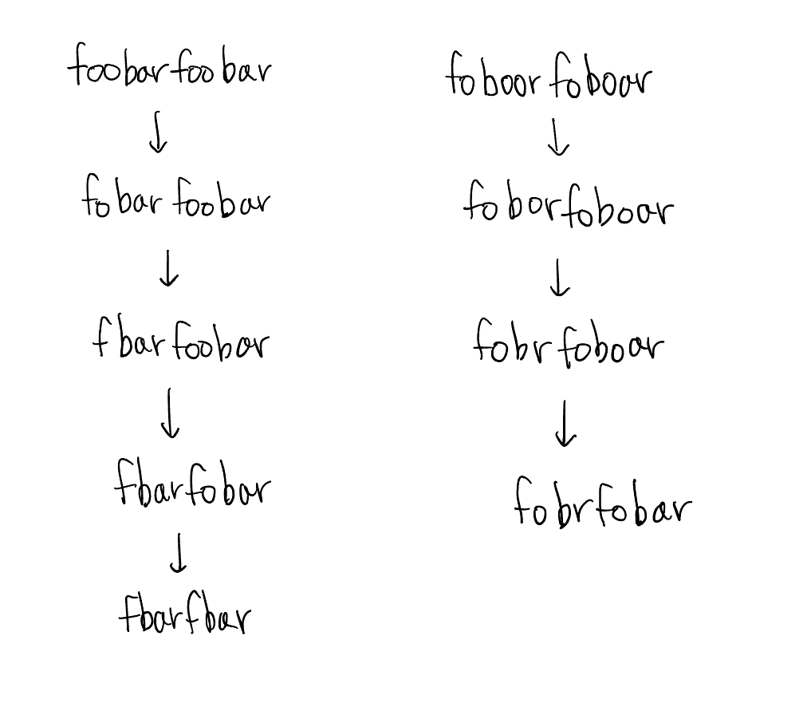

# 문제

주어진 문자열 `S`에서 부분 문자열 `From`을 찾아 모두 `To`로 교체하는 제네릭 `ReplaceAll<S, From, To>`을 구현하세요.

예시:

```ts
type replaced = ReplaceAll<'t y p e s', ' ', ''>; // expected to be 'types'
```

# 정답 및 풀이 과정

## 답

```ts
type ReplaceAll<S extends string, From extends string, To extends string> = From extends ''
  ? S
  : S extends `${infer First}${From}${infer Rest}`
  ? `${First}${To}${ReplaceAll<Rest, From, To>}`
  : S;
```

## 풀이 과정

# 어려웠던 점 & 알게 된 점

```ts
type ReplaceAll<S extends string, From extends string, To extends string> = From extends ''
  ? S
  : S extends `${infer First}${From}${infer Rest}`
  ? `${ReplaceAll<`${First}${To}${Rest}`, From, To>}`
  : S;
```


처음엔 First, To, Rest 모두 재귀로 돌렸는데, 테스트 케이스 2개를 통과하지 못했다.



이유는 변환 되었으면 다시 변환이 되면 안되는데 직접 풀이 한 사진과 같이 From이 관련된 문자열이 S에 존재하면 무조건 변환했기 때문이다.

```ts
type ReplaceAll<S extends string, From extends string, To extends string> = From extends ''
  ? S
  : S extends `${infer First}${From}${infer Rest}`
  ? `${First}${To}${ReplaceAll<Rest, From, To>}`
  : S;
```

따라서 변환된 문자열은 제외한 나머지(Rest)를 ReplaceAll을 통해 재귀적으로 타입 추론하면 테스트가 모두 통과 되는 것을 확인할 수 있다!
